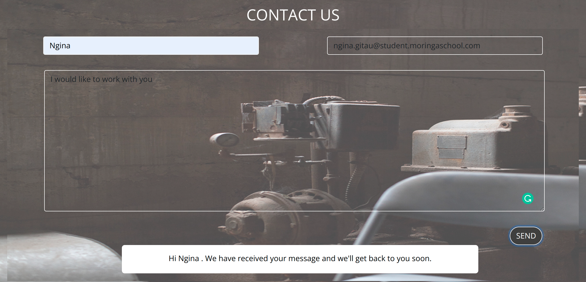

# Delani Studio Landing Page
A landing page created for Delani Studio as a requirement for the Moringa Prep Module.
 
### By Ngina Gitau @Ngina-G

 Landing page

 

#### Check live demonstration <a href="https://ngina-g.github.io/"><strong>here</strong></a>

## Description
This website gives a practiacl view of the use of bootstrap, jquery and the use of forms. It includes effects created with jQuery and custom CSS. In dfferent sectoins there are different kinds of interactivity.

### How To
Upon opening the page, the user is greeted with the landing page. Input user data in the fields in the <strong>form </strong>at the bottom of the Landing page and through the use of mailchimp, the user's email wil be tracked.

 Input form

#### Requirements
JSFiddle or JavaScript Console.

### Setup Instructions and Installation
Clone this repository to a location in your file system. git clone https://github.com/Ngina-G/Ngina-G.github.io
Open terminal command line then navigate to the root folder of the application. cd Ngina-G.github.io
Open index.html on your Browser.

### Behavior Driven Development 
<dl>
<dt>Displays Form For Entering Name, Email and Message</dt>
    <dd>INPUT: "User's name Entered"</dd>
    <dd>INPUT: "User's email Entered"</dd>
    <dd>INPUT: "User's Message Entered"</dd>
    <dd>OUTPUT: "Displays Pop-up Personalized According to Submitted Name"</dd>
<dt>Displays an Error Alert if Fields of Input Left Blank</dt>
    <dd>OUTPUT: "Displays Error Message"</dd>
</dl>

### Known bugs
There were no bugs faced but if you have any queries or comments kindly reach out through this email Nginagitau11@outlook.com

## Technologies Used
HTML, CSS, Bootstrap, jQuery and JavaScript.

### License
MIT License

Copyright (c) 2022 Ngina

### Contact Me
If you have any questions or comments, 
conatct me at Nginagitau11@outlook.com
<a href="https://mailchi.mp/6047bb20258d/testingdelani">Mailchimp</a>
 

